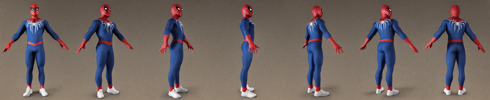
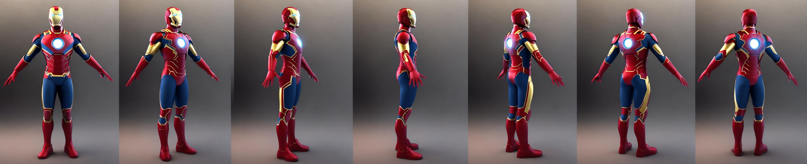

# Multiview-Avatar
repository for multiview character generation based on SDv1.5

# 
# 

## Requirements
- diffusers
- torch
- xformers
- 16GB GPU


## Installation
```
git clone https://github.com/ArcherFMY/Multiview-Avatar.git
cd Multiview-Avatar
python setup.py develop
```

## Getting Started
### Download Models
Download models from [Baidu Disk](https://pan.baidu.com/s/1RPHZitmrKIxwuEYadimo4Q?pwd=xs2i) or [Google Drive](https://drive.google.com/file/d/1_LWfcVNZM4ASiQ2lCgegwooMhdU5Wli7/view?usp=share_link). Unzip `models.zip` into the root directory of the project.
```
${ROOT}  
|-- data  
|   |-- test.jpg
|-- models  
|   |-- base-model
|   |-- control-imgs
|   |-- controlnet-lineart
|   |-- controlnet-pose
|   |-- wildcards
|-- mvavatar
|...
```
Or download the models from [hugging face](https://huggingface.co/Jinlin123/Multiview-Avatar).

### Inference
```
from mvavatar import MVAvatar

model = MVAvatar.from_pretrained('models', device='cuda')
image = model.inference('1 girl')

image.save('data/test.jpg')
```
see more in `demo.py`

## License

This code is released under the Apache License 2.0 (refer to the LICENSE file for details).


